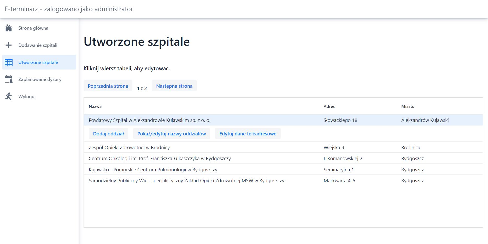
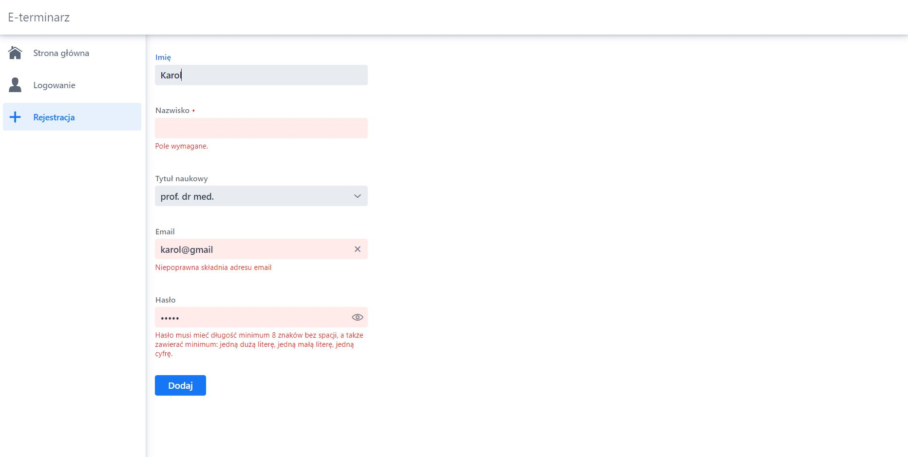
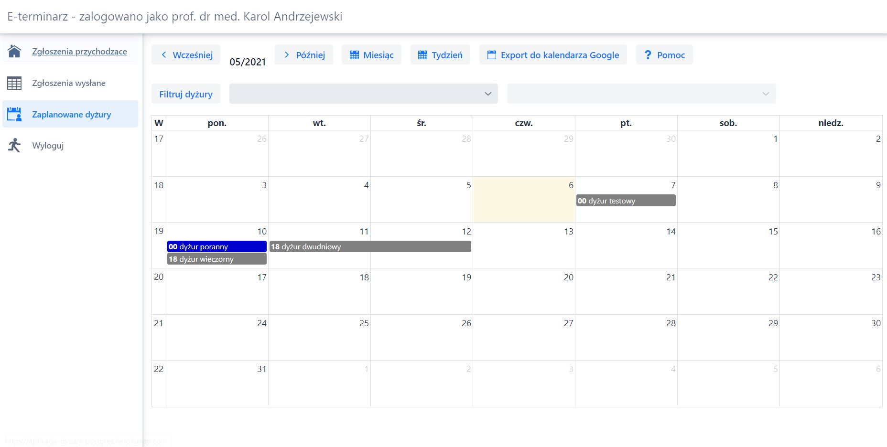
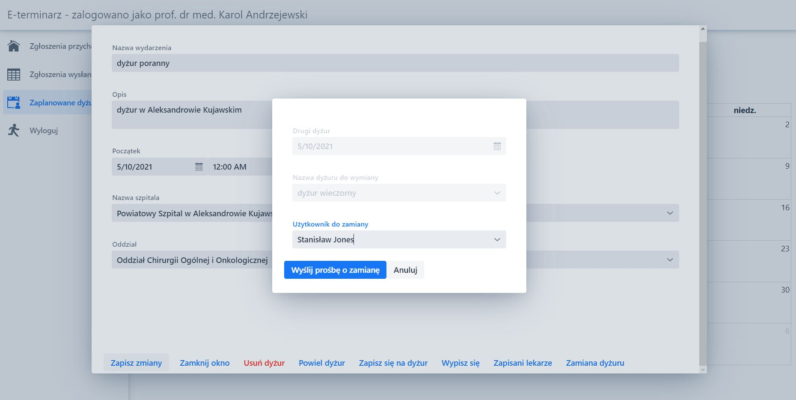
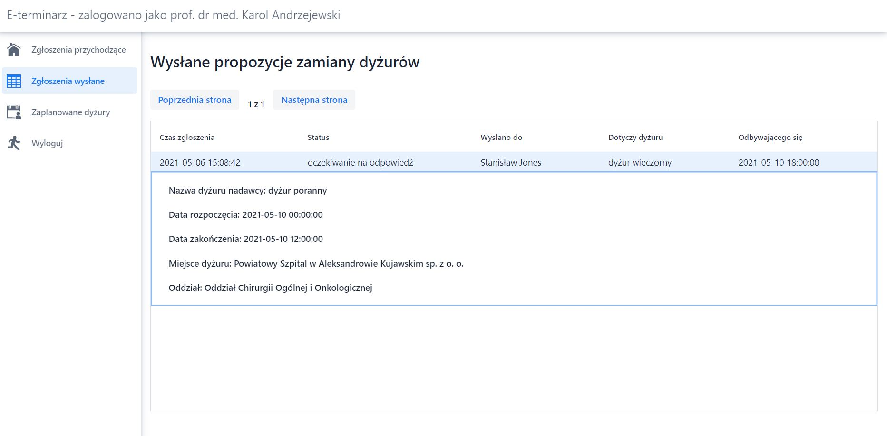
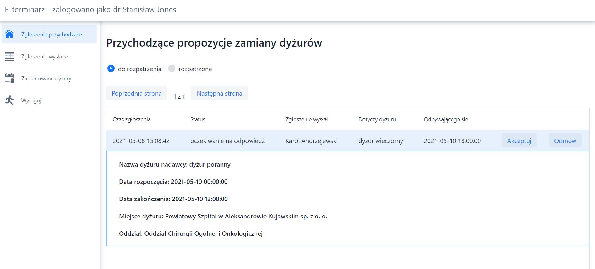

# Medical duty rostering app

## Purpose of this app
This is a rostering app. It enables doctors to plan new duties as well as join duties planned by other doctors (max. 8 doctors per duty).

Users can define where (name of the hospital and name of the department) and when the duty takes place. 
This app also enables users to switch duties between one another.

## Used technologies
* Java 1.8,
* Vaadin 14,
* Spring Boot,
* Spring Security,
* PostgreSQL database.

## Live demo
Link to live demo is available below:

[https://aplikacja-dyzury-postgres.herokuapp.com/](https://aplikacja-dyzury-postgres.herokuapp.com/)

Please be aware that the  page may take up to 30 seconds to initially load. This is due to free account limitations on Heroku - unused apps are hibernated and only resumed when someone is trying to use them. After that initial waiting period, the app will work normally.

## Implementation
The app was implemented using technologies mentioned in **Used technologies** section. 

Login form was secured with Spring Security.
Forms requiring user input were validated using [Vaadin Binder](https://vaadin.com/docs/v14/flow/binding-data/tutorial-flow-components-binder) in order to avoid invalid or incomplete data.
All the tables were paginated using Pageable interface from Spring Data JPA. 

## Short overview of implemented functionalities

The app has an admin panel (access with email: admin@gmail.com and password: AdminPass1). Admin can add new hospitals and departments as well as edit duties added by others users.

Ordinary users can create an account. In the screen below it is visible how the form ws secured against corrupt or incomplete data. The form forces users to fill all fields. In case of email address, the validation is based on regular expressions. In case of password, certain rules have to be met i.e. password length, at least one number, etc.

Logged in users can view all registered duties. If they sign up for a duty, then it's marked by blue color. Otherwise, it's marked gray.

The app also enables users to switch duties between one another. In order to do it, the user has to click on a duty, go to section Zamiana dyżury and send a request. If the other user agrees, then the duties will be automatically switched.

Sent requests can be seen in a **Zgłoszenia wysłane** tab.

The other users can see switch requests from other doctors in a separate panel and decide whether or not to agree.

